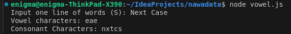
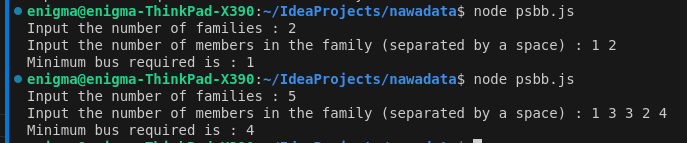

This is a program to find vowels and consonants and a program to count minibus passengers using JavaScript.
Berikut adalah terjemahan dari kalimat yang Anda berikan ke dalam bahasa Inggris:

To run the vowels-consonants file, execute the command `node vowel-consonant.js`

Here is the code of program vowel-consonant.js

```javascript
const prompt = require('prompt-sync')(); 


let inputString = prompt("Input one line of words (S): ")                                                       

function findVowels(text) {
    const vowels = "aeiouAEIOU";
    let result = '';
    
    for (let i = 0; i < text.length; i++) {
       if(vowels.includes(text[i])) {
        result += text[i].toLowerCase()
       }
    }
    return result;
}

function findConsonant(text) {
    const vowels = "aeiouAEIOU";
    let result = '';
    
    for (let i = 0; i < text.length; i++) {
       if(!vowels.includes(text[i])) {
        result += text[i].toLowerCase().replace(/ /g,"")
       }
    }
    return result;
}

let vowelsFound = findVowels(inputString)
let consonantFound = findConsonant(inputString)

console.log(`Vowel characters: ${vowelsFound}`)
console.log(`Consonant Characters: ${consonantFound}`)

```

The output will be approximately like this



And this is a program code of psbb.js

```javascript

const prompt = require('prompt-sync')()

function miniBus() {
    let numFamilies = parseInt(prompt("Input the number of families : "));
    
    let familyMembers = prompt("Input the number of members in the family (separated by a space) : ").split(' ').map(Number);
    
    if (numFamilies !== familyMembers.length) {
        console.log("Input must be equal with count of family");
        return;
    }
    
    for (let i = 0; i < familyMembers.length - 1; i++) {
        for (let j = 0; j < familyMembers.length - 1 - i; j++) {
            if (familyMembers[j] < familyMembers[j + 1]) {
                let temp = familyMembers[j];
                familyMembers[j] = familyMembers[j + 1];
                familyMembers[j + 1] = temp;
            }
        }
    }
    
    let busCount = 0;
    let i = 0;
    let j = familyMembers.length - 1;
    
    while (i <= j) {
        if (familyMembers[i] + familyMembers[j] <= 4) {
            j--;
        }
        i++;
        busCount++;
    }
    
    console.log("Minimum bus required is : " + busCount);
}

miniBus();

```

To run the program, execute the command `node psbb.js`

Here is the output



